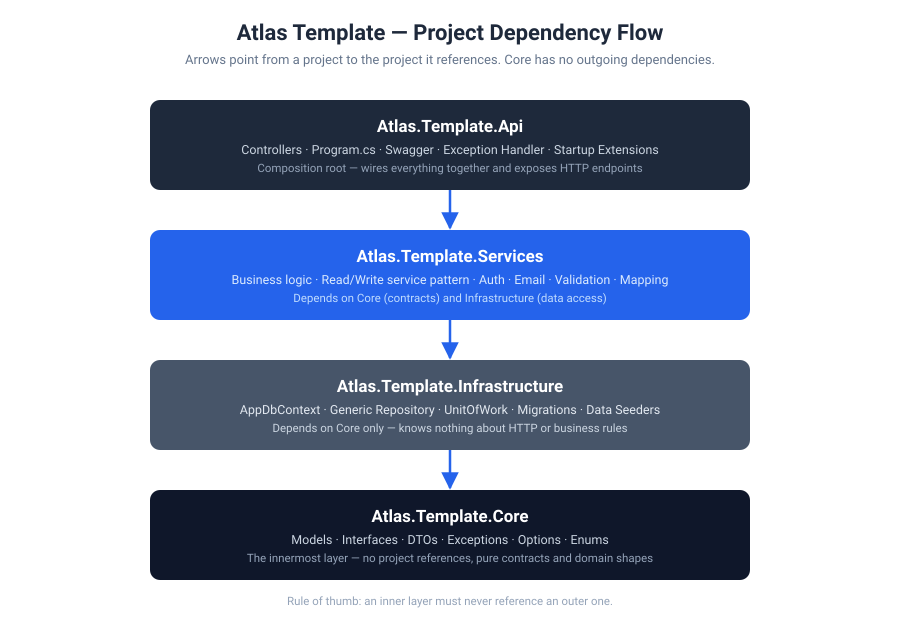

<div align="center">

  

  <h3>A reusable ASP.NET Core Web API starter template</h3>

  <p>
    Build on a solid architecture instead of rebuilding backend infrastructure from scratch.
  </p>

  <p>
    
    
    
    
  </p>

</div>

---

Atlas is a reusable ASP.NET Core Web API starter template built on Clean Architecture. It exists so that starting a new backend project doesn't mean re-solving the same setup problems every time — authentication, data access patterns, error handling, validation, and API conventions are already in place and ready to build on top of.

Instead of wiring up Identity, JWT, a repository pattern, and consistent error responses from scratch on day one of every new project, you clone Atlas, rename it, and start writing the business logic that's actually specific to your product.

## Who this is for

You're a .NET developer starting a new Web API project and want a solid, opinionated Clean Architecture foundation — generic data access, authentication, and error handling already solved — so you can spend your first day on business logic instead of plumbing.

## Tech stack

| Concern | Library |
|---|---|
| Framework | ASP.NET Core 8 (.NET 8) |
| Data access | Entity Framework Core 8 (SQL Server) |
| Identity & auth | ASP.NET Core Identity, JWT Bearer (`Microsoft.AspNetCore.Authentication.JwtBearer`) |
| Validation | FluentValidation |
| Object mapping | Mapster |
| Email | MailKit / MimeKit |
| API docs | Swashbuckle (Swagger) |
| API versioning | Asp.Versioning.Mvc |

## Architecture

Atlas follows Clean Architecture as four projects, each depending only on the layers beneath it:



- **`Atlas.Template.Core`** — the innermost layer. Domain models, interfaces, DTOs, custom exceptions, options, and enums. No project references — everything else depends on this, it depends on nothing.
- **`Atlas.Template.Infrastructure`** — EF Core concerns: `AppDbContext`, the generic repository, `UnitOfWork`, entity configurations, migrations, and data seeders. Knows nothing about HTTP or business rules.
- **`Atlas.Template.Services`** — the business layer. Generic Read/Write service base classes, concrete services (account, user, token, email), validation, mapping, and all the `IServiceCollection` wiring that `Program.cs` calls into.
- **`Atlas.Template.Api`** — the composition root. Thin controllers, the global exception handler, Swagger/versioning setup, and `Program.cs`.

See [`docs/01-architecture.md`](docs/01-architecture.md) for the full breakdown of why the layers are shaped this way.

## Project structure

```
Atlas-template/
├── src/
│   ├── Atlas.Template.Api/           # Controllers, Program.cs, exception handler, Swagger
│   ├── Atlas.Template.Core/          # Models, interfaces, DTOs, exceptions, options
│   ├── Atlas.Template.Infrastructure/# DbContext, repositories, migrations, data seeders
│   └── Atlas.Template.Services/      # Business services, DI wiring, validation, mapping
├── docs/                             # Tutorial-style documentation
├── assets/                           
└── tests/                            
```

## Features

### Implemented

- **Clean Architecture layering** 
- **ASP.NET Core Identity** 
- **JWT authentication** with refresh token rotation and explicit revocation (cookie-based refresh token delivery)
- **Generic repository + Unit of Work pattern**
- **Specification pattern** for filtering, ordering, includes, and pagination without leaking query logic into services
- **Generic Read/Write service pattern** 
- **FluentValidation** 
- **Unified error handling**
- **API versioning** 
- **Consistent response envelope** (`Response` / `Response<T>`) across every endpoint
- **Data seeders** with automatic discovery via reflection and explicit run ordering
- **Custom email system** — layout-wrapped HTML templates sent via MailKit
- **File upload handling** 
- **Fully implemented account flow** — register, login, confirm email, forget/reset password, refresh/revoke token, get/update/delete own profile, change password
- **Options pattern** for typed configuration (e.g. `EmailOptions`)


# Getting Started


## 1. Clone the repository

Create or navigate to your projects directory, then clone the repository:

```bash
git clone https://github.com/Mahmoud8276/Atlas-Template.git
cd Atlas-Template

```

Open `Atlas.Template.sln` in Visual Studio or your preferred editor.

## 2. Configure the application

Atlas Template uses the standard ASP.NET Core configuration system. Configure the following values in `appsettings.Development.json` or, preferably, provide sensitive values through **.NET User Secrets** or environment variables.

```jsonc
{
  "Logging": {
    "LogLevel": {
      "Default": "Information",        // Default application log level
      "Microsoft.AspNetCore": "Warning" // ASP.NET Core framework log level
    }
  },

  "AllowedHosts": "*", // Hosts allowed to access the application

  "ConnectionStrings": {
    "DefaultConnection": "" // SQL Server connection string
  },

  "Storage": {
    "BaseUrl": "" // Application base URL, used when generating file and application URLs
  },

  "Jwt": {
    "Key": "", // Secret key used to sign JWT access tokens
    "Issuer": "", // Identifies the application that issues the token
    "Audience": "", // Identifies the intended recipient of the token
    "ExpirationInMinutes": 30, // Access token lifetime
    "RefreshTokenExpirationInDays": 30 // Refresh token lifetime
  },

  "Email": {
    "Host": "", // SMTP server used to send emails
    "SenderEmail": "", // Email address used as the sender
    "SenderName": "Atlas Template", // Display name shown to recipients
    "Password": "", // SMTP password or provider-specific app password
    "Port": 587 // SMTP port
  }
}

```

> **Tip:** Do not commit real passwords, connection strings, or JWT keys. Use [User Secrets](https://learn.microsoft.com/en-us/aspnet/core/security/app-secrets) for local development.

## 3. Run the API

Restore dependencies and start the API:

```bash
dotnet restore
dotnet run --project src/Atlas.Template.Api

```

Entity Framework Core migrations are applied automatically during startup, and the database is seeded with the required initial data.

## 4. Explore the API

Once the API is running, open Swagger:

```text
https://localhost:<port>/swagger

```

## Documentation

Each file in `docs/` covers one part of the template in a tutorial style — a short explanation of *why* it's built that way, followed by a worked example. Read them in order the first time; use them as reference afterward.

| # | Doc | Covers |
|---|---|---|
| 01 | [Architecture](docs/01-architecture.md) | The four-project layering and why the dependency rule matters |
| 02 | [Generic Repository & Unit of Work](docs/02-generic-repository-and-uow.md) | Data access without writing a repository per entity |
| 03 | [Specifications](docs/03-specifications.md) | Filtering, ordering, includes, and pagination via the specification pattern |
| 04 | [Read/Write Service Pattern](docs/04-read-write-service-pattern.md) | Building a service on top of `ReadService`/`WriteService` |
| 05 | [Authentication & JWT](docs/05-authentication-and-jwt.md) | Identity setup, token issuing, refresh rotation, revocation |
| 06 | [Account & User Endpoints](docs/06-account-and-user-endpoints.md) | Walkthrough of the implemented account and user flows |
| 07 | [Exception Handling](docs/07-exception-handling.md) | The `AppException` hierarchy and the unified `ProblemDetails` response |
| 08 | [Email System](docs/08-email-system.md) | The layout-wrapped email templates and how to add a new one |
| 09 | [Data Seeding](docs/09-data-seeding.md) | Writing a new seeder and how ordering/auto-discovery works |
| 10 | [API Versioning & Responses](docs/10-api-versioning-and-responses.md) | Version routing, Swagger setup, the `Response<T>` envelope |
| 11 | [Configuration & Options](docs/11-configuration-and-options.md) | Required settings and the options pattern |
| 12 | [Building a New Feature](docs/12-building-a-new-feature.md) | End-to-end worked example: entity → migration → spec → repository → service → endpoint |