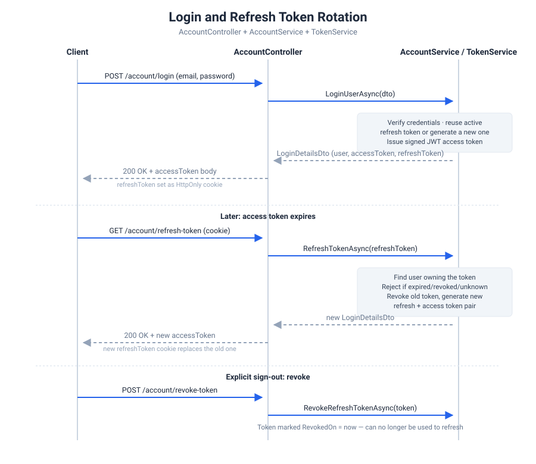

# 05 — Authentication & JWT

Atlas combines ASP.NET Core Identity (for user management — passwords, roles, tokens for email confirmation/password reset) with a hand-rolled JWT + refresh token scheme (for API authentication). They solve different problems: Identity owns *who a user is and how their credentials are managed*; the JWT layer owns *how a client proves it's that user on every request without sending a password each time*.

## Identity setup

`AddIdentityConfigurations` (Services layer) wires up Identity with the template's custom user and role types:

```csharp
services.AddIdentity<AppUser, UserRole>(options => { })
    .AddRoles<UserRole>()
    .AddEntityFrameworkStores<AppDbContext>()
    .AddSignInManager()
    .AddDefaultTokenProviders();
```

- **`AppUser : IdentityUser`** and **`UserRole : IdentityRole`** — the template's custom Identity types, extended with fields like `FirstName`, `LastName`, `Image`
- **`AddDefaultTokenProviders()`** is what makes `GenerateEmailConfirmationTokenAsync` and `GeneratePasswordResetTokenAsync` work — these are separate, shorter-lived Identity tokens, not the JWT you authenticate API calls with
- The `options => { }` block is empty — password complexity, lockout, and username rules are all still ASP.NET Core Identity defaults. If you want stricter rules, this is where you'd add them.

## JWT bearer setup

`AddAuthenticationAndAuthorization` (Services layer) registers the JWT bearer scheme as the default:

```csharp
services.AddAuthentication(options =>
{
    options.DefaultAuthenticateScheme = JwtBearerDefaults.AuthenticationScheme;
    options.DefaultChallengeScheme = JwtBearerDefaults.AuthenticationScheme;
}).AddJwtBearer(options =>
{
    options.TokenValidationParameters = new TokenValidationParameters
    {
        ValidateAudience = true,
        ValidAudience = configuration["Jwt:Audience"],
        ValidateIssuer = true,
        ValidIssuer = configuration["Jwt:Issuer"],
        ValidateLifetime = true,
        ValidateIssuerSigningKey = true,
        IssuerSigningKey = new SymmetricSecurityKey(Encoding.UTF8.GetBytes(configuration["Jwt:Key"])),
        ClockSkew = TimeSpan.Zero
    };

    options.Events = JwtBearerEventsConfig.Build();
});
```

`ClockSkew = TimeSpan.Zero` is a deliberate choice — by default ASP.NET Core allows a 5-minute grace period past a token's expiry, and Atlas turns that off so `ExpirationInMinutes` means exactly what it says.

`options.Events = JwtBearerEventsConfig.Build()` is what makes an expired or missing token return the same `ProblemDetails` shape as every other error in the API, instead of the framework's default empty 401 — see [`docs/08-exception-handling.md`](08-exception-handling.md) for the full picture of how that connects.

## `TokenService` — issuing tokens

- **`GenerateAccessTokenAsync(user)`** — builds a signed JWT with the user's id, email, name, and roles as claims, signed with HMAC-SHA256 using `Jwt:Key`, expiring after `Jwt:ExpirationInMinutes`
- **`GenerateRefreshToken()`** — generates a 64-byte cryptographically random token (not a JWT — just an opaque random string), valid for `Jwt:RefreshTokenExpirationInDays`

The access token is short-lived and stateless — it's never stored anywhere, and its validity is checked purely by verifying the signature and expiry. The refresh token is the opposite: long-lived and stateful, stored in the database via the `RefreshToken` entity, so it can be looked up, rotated, or explicitly revoked.

## `RefreshToken` — why it's stateful

```csharp
public class RefreshToken : BaseModel<int>
{
    public string Token { get; set; }
    public DateTime ExpiresOn { get; set; }
    public DateTime? RevokedOn { get; set; }
    public bool IsExpired => DateTime.UtcNow >= ExpiresOn;
    public bool IsActive => RevokedOn == null && !IsExpired;

    public string AppUserId { get; set; }
    public AppUser AppUser { get; set; }
}
```

A user can have multiple refresh tokens (one per device/session, effectively). `IsActive` is what every login/refresh/revoke check relies on — a token that's expired *or* explicitly revoked is no longer usable.

## The full flow



- **Login** — `AccountService.LoginUserAsync` checks the password via `SignInManager`, reuses the user's existing active refresh token if one exists (rather than issuing a new one on every login), and returns both tokens.
- **Refresh** — `RefreshTokenAsync` looks up the user by the refresh token itself (not by user id — the client only has the token), rejects it if inactive, marks it revoked, and issues a brand-new access + refresh token pair. This is rotation: a refresh token is single-use.
- **Revoke** — `RevokeRefreshTokenAsync` just marks a token's `RevokedOn`, without issuing anything new. This is what a "log out" action should call.

`AccountController` handles the access token as a normal JSON response field, but the refresh token is set as an **HttpOnly cookie** (`SetRefreshTokenInCookie`) rather than returned in the body — that keeps it out of reach of JavaScript running on the page, which matters since it's long-lived. Note the cookie is currently created with only `HttpOnly` set; add `Secure = true` and an explicit `SameSite` policy once you're serving over HTTPS, since neither is set explicitly yet.

## Protecting an endpoint

Standard ASP.NET Core authorization attributes work as-is, since `TokenService` puts roles into the JWT as `ClaimTypes.Role` claims:

```csharp
[Authorize]                    // any authenticated user
[Authorize(Roles = "Admin")]   // must have the Admin role
```

Inside a service (not a controller), the current user's id comes from the claims via a small helper rather than by re-parsing the token:

```csharp
var userId = _httpContextAccessor.HttpContext.GetRequiredUserId(); // reads ClaimTypes.NameIdentifier
```

This is how `GetUserDataAsync`, `UpdateUserDataAsync`, `DeleteUserDataAsync`, and `ChangePasswordAsync` all know *which* user they're acting on without the caller having to pass an id explicitly — it's always "the user attached to this token."

---

**Next:** [06 — Account & User Endpoints](06-account-and-user-endpoints.md)