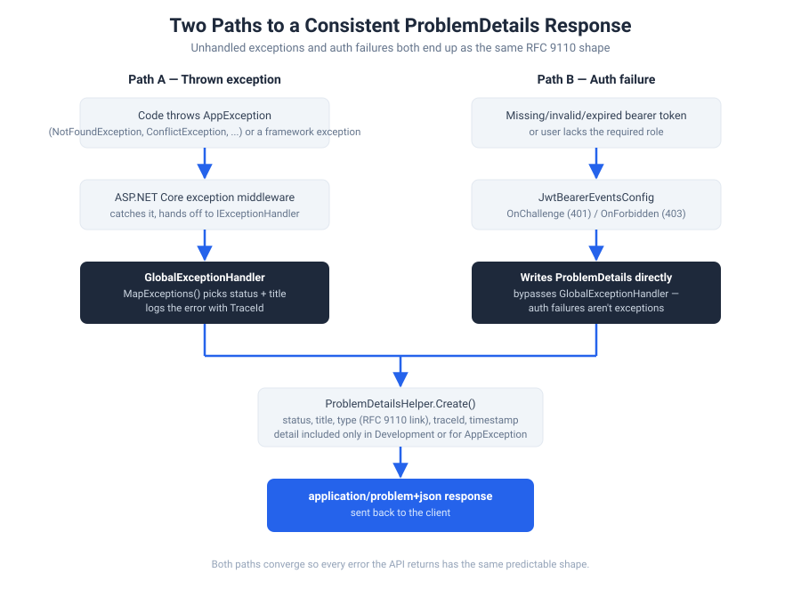

# 07 — Exception Handling

Atlas guarantees that every error response — whether it comes from a thrown exception or an authentication failure — has the same shape: an RFC 9110-compliant `ProblemDetails` JSON body. A client only needs to know how to parse one error format, no matter what actually went wrong.



## Two ways services can signal failure — and which one Atlas actually uses today

There are two legitimate patterns for a service to report "this request failed":

1. **Return a `Response.Fail(...)`** — the method completes normally, just with `IsSuccess = false` and a status code/message set on the `Response` object.
2. **Throw an `AppException`** — the method exits abnormally, and `GlobalExceptionHandler` catches it further up the pipeline and turns it into a `ProblemDetails` response.

**Worth knowing before you write new code:** every service currently in the template — `AccountService`, `UserService`, and the `WriteService`/`ReadService` base classes — uses option 1 exclusively. Nothing anywhere in the codebase actually throws `NotFoundException`, `BadRequestException`, `ConflictException`, or `ValidationException`, even though all four exist and `GlobalExceptionHandler` is fully wired to catch them. The `AppException` hierarchy is real, tested-by-design infrastructure — it's just not exercised by any current code path. `GlobalExceptionHandler`'s `AppException` branch today only ever fires for exceptions *you* choose to throw once you start using it.

Both styles are valid; which one fits depends on where you are in the call stack:
- **`Response.Fail`** is easy to follow when the failure happens right where you're about to return anyway — most of what's in the template today.
- **Throwing an `AppException`** is more useful several calls deep, where threading a `Response` back up through three or four layers just to report "not found" would be awkward. Throw once, and `GlobalExceptionHandler` handles turning it into the right HTTP response no matter how deep it was thrown from.

## The `AppException` hierarchy

All defined in Core, all carrying their own `HttpStatusCode`:

- **`AppException`** (abstract base) — `Message` + `StatusCode`
- **`NotFoundException(resourceName, key)`** → 404, builds the message for you: `"{resourceName} with iD {key} not found!"`
- **`BadRequestException(message)`** → 400
- **`ConflictException(message)`** → 409
- **`ValidationException`** → 400, and additionally carries an `Errors` dictionary (`IDictionary<string, string[]>`) for field-level messages

## `GlobalExceptionHandler`

Implements ASP.NET Core's `IExceptionHandler`, so it's invoked automatically by the framework's exception-handling middleware for anything unhandled:

```csharp
private (int statusCode, string title) MapExceptions(Exception exception) => exception switch
{
    AppException AppEx => ((int)AppEx.StatusCode, AppEx.Message),
    ArgumentNullException => (StatusCodes.Status400BadRequest, "Invalid argument provided"),
    ArgumentException => (StatusCodes.Status400BadRequest, "Invalid argument provided"),
    UnauthorizedAccessException => (StatusCodes.Status401Unauthorized, "Unauthorized"),
    _ => (StatusCodes.Status500InternalServerError, "An unexpected error occurred")
};
```

Anything not explicitly matched — a null reference, a timeout, a database error — falls through to a generic 500. It also logs every exception with the request's `TraceId` before responding, so you can correlate what the client saw with what's in your logs.

**Detail is environment-aware:** in Development, the real exception message is always included in the response. In Production, it's only included if the exception is an `AppException` (i.e., one you deliberately threw with a safe, user-facing message) — anything else returns `Detail: null`, so a raw exception message (which might mention internal types, SQL, or file paths) never leaks to a client in production.

## `JwtBearerEventsConfig` — the other path

Authentication failures never throw an exception at all — the JWT bearer middleware handles them through its own `OnChallenge`/`OnForbidden` events, which is why they need separate handling (see [`docs/05-authentication-and-jwt.md`](05-authentication-and-jwt.md)):

```csharp
OnChallenge = async context =>
{
    context.HandleResponse();
    var problemDetails = ProblemDetailsHelper.Create(context.HttpContext, 401, "Unauthorized", "...");
    // written via IProblemDetailsService, same as GlobalExceptionHandler
}
```

Both `GlobalExceptionHandler` and `JwtBearerEventsConfig` build their response through the same `ProblemDetailsHelper.Create(...)` — that shared helper is what actually guarantees the "one consistent shape" promise, not the exception-catching mechanism itself.

## Worked example: choosing to throw instead of returning `Response.Fail`

If you were writing `ProductService.GetByIdAsync` and preferred the throw style over `ReadService`'s built-in `Response.Fail`-based `NotFound` handling:

```csharp
public async Task<ProductDetailsDto> GetByIdOrThrowAsync(int id)
{
    var product = await _repository.GetByIdAsync(id);
    if (product is null)
        throw new NotFoundException(nameof(Product), id);

    return product.Adapt<ProductDetailsDto>();
}
```

You don't need to catch this anywhere — `GlobalExceptionHandler` turns it into a `404` `ProblemDetails` response automatically, with `"Product with iD 7 not found!"` as the title.

---

**Next:** [08 — Email System](08-email-system.md)